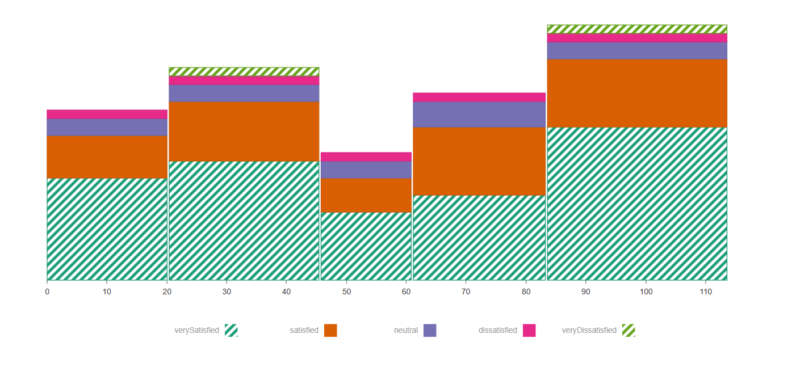

# Overview

The mekko chart component, provided by the nivo library, also known by the Marimekko chart, is a two-dimensional stacked chart where the width of the columns varies according to the size of the data sections provided. It can be useful in many purposes, mainly for data analysis, and it combines two dimensions of information into a single chart, providing an overall complete perspective of complex data.

## Mekko chart component



### Qodly source

| Name         | Type  | Required | Description                                                                                     |
| ------------ | ----- | -------- | ----------------------------------------------------------------------------------------------- |
| Qodly source | Array | Yes      | Will contain the set of objects where each object represents a series or category in the chart. |

## Properties

| Name           | Type    | Default  | Description                                                                                                                   |
| -------------- | ------- | -------- | ----------------------------------------------------------------------------------------------------------------------------- |
| Layout         | string  | Vertical | Sets how the bars will be displayed, by default it's vertical                                                                   |
| Offset         | string  | none     | Refers to the offset type                                                                                                       |     |
| Inner padding  | number  | 9        | Sets the inner padding                                                                                                          |
| Outer padding  | number  | 0        | Sets the outer padding                                                                                                          |
| Color scheme   | string  | Nivo     | Sets the bars color'scheme                                                                                                      |
| Show pattern   | boolean | false    | Controls if the bars' lines' patterns are visible or not                                                                        |
| Is interactive | boolean | false    | Controls if the chart is interactive by showing or hiding the informing dialog linked to each segment once hovering on them not |
| Display label  | boolean | false    | Controls if the labels on each bar segement is visible or not                                                                   |
| Display total  | boolean | false    | Controls if the total of all the bars segments is visible or not                                                                |

#### Data sample

```Json
[
    {
      "statement": "Statement 1", //id
      "participation": 9, //value
      "dimension1": 15,//dimension 1
      "dimension2": 9,
      "dimension3": 22,
      "dimension4": 20
    },
    {
      "statement": "Statement 2",
      "participation": 12,
      "dimension1": 28,
      "dimension2": 0,
      "dimension3": 3,
      "dimension4": 26
    },...]
```
