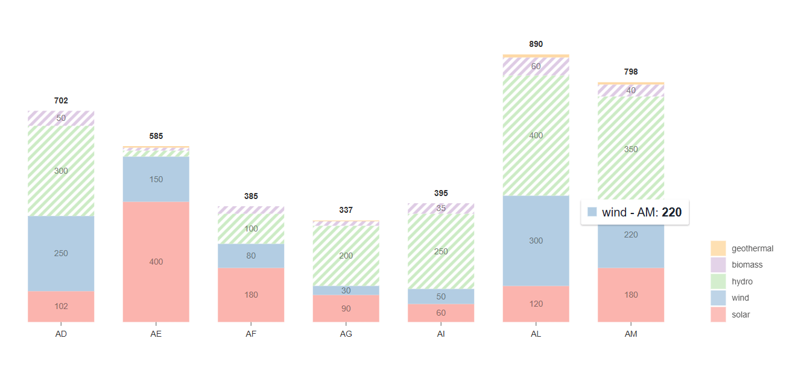

# Overview

The following component embed two chart types that can be used to display dimentional data easily, provided by the nivo library. The mekko chart (also known by the Marimekko chart) , is a two-dimensional stacked chart where the width of the columns varies according to the size of the data sections provided, and the bar chart that can display multiple stacked data series.
They can be useful in many purposes, mainly for data analysis, and it combines two dimensions of information into a single chart, providing an overall complete perspective of complex data.

## Mekko chart component


### Qodly source

| Name         | Type  | Required | Description                                                                                     |
| ------------ | ----- | -------- | ----------------------------------------------------------------------------------------------- |
| Qodly source | Array | Yes      | Will contain the set of objects where each object represents a series or category in the chart. |

## Properties

| Name           | Type    | Default  | Description                                                                                                                   |
| -------------- | ------- | -------- | ----------------------------------------------------------------------------------------------------------------------------- |
| Layout         | string  | Vertical | Sets how the bars will be displayed, by default it's vertical                                                                   |
| Offset         | string  | none     | Refers to the offset type                                                                                                       |     |
| Inner padding  | number  | 9        | Sets the inner padding                                                                                                          |
| Outer padding  | number  | 0        | Sets the outer padding                                                                                                          |
| Color scheme   | string  | Nivo     | Sets the bars color'scheme                                                                                                      |
| Show pattern   | boolean | false    | Controls if the bars' lines' patterns are visible or not                                                                        |
| Is interactive | boolean | false    | Controls if the chart is interactive by showing or hiding the informing dialog linked to each segment once hovering on them not |


#### Data sample

```Json 
[
    {
      "statement": "Statement 1", //id
      "participation": 9, //value 
      "dimension1": 15,//dimension 1
      "dimension2": 9,
      "dimension3": 22,
      "dimension4": 20
    },
    {
      "statement": "Statement 2",
      "participation": 12,
      "dimension1": 28,
      "dimension2": 0,
      "dimension3": 3,
      "dimension4": 26
    },...]
```

## Bar chart component



### Qodly source

| Name         | Type  | Required | Description                                                                                     |
| ------------ | ----- | -------- | ----------------------------------------------------------------------------------------------- |
| Qodly source | Array | Yes      | Will contain the set of objects where each object represents a series or category in the chart. |

## Properties

| Name           | Type    | Default  | Description                                                                                                                   |
| -------------- | ------- | -------- | ----------------------------------------------------------------------------------------------------------------------------- |
| Enable label   | boolean | true     | If set to true, segment labels will be displayed within the bars                                                              |
| Is interactive | boolean | true     | If set to true,the chart will become interactive by showing the informing dialog linked to each segment once hovering on them |
| Enable totals  | boolean | true     | If set to true, totals will be displayed on each bar's top                                                                    |
| Show pattern   | boolean | true     | If set to true, patterns will be displayed on two random segements                                                            |
| Show legend    | boolean | true     | If set to true, the legend showing what each segement is will be displayed on the bottom-right of the chart                   |
| Inner padding  | number  | 0        | Sets the inner padding                                                                                                        |
| Layout         | string  | Vertical | Sets how the bars will be displayed, by default it's vertical                                                                 |
| Group mode     | string  | Vertical | Sets how the bars will be displayed, by default it's stacked                                                                  |
| Color scheme   | string  | Vertical | Sets the bars' color scheme                                                                                                   |

#### Data sample

```Json
[
    {
      "country": "AD", //index
      "Serie 1": 181, //key 1
      "Serie 2": 178,
      "Serie 3": 178,
      "Serie 4": 59,
      "Serie 5": 46,
      "Serie 6": 79
    },
    {
      "country": "AE",
      "Serie 1": 42,
      "Serie 2": 58,
      "Serie 3": 42,
      "Serie 4": 169,
      "Serie 5": 200,
      "Serie 6": 173,
    },...
  ]
```
